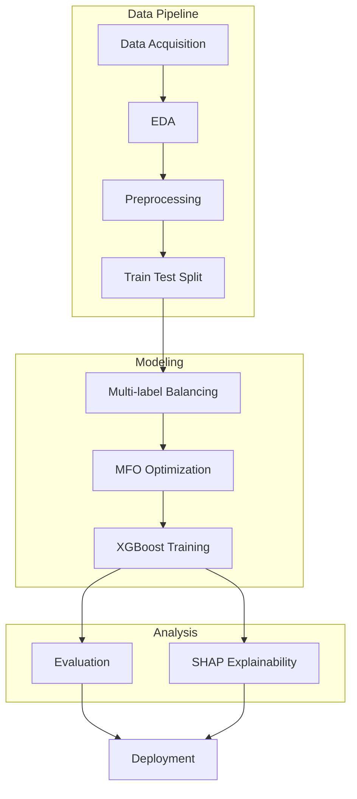

```mermaid
flowchart TD

subgraph Data Pipeline
A[Data Acquisition]
B[EDA]
C[Preprocessing]
D[Train Test Split]
end

subgraph Modeling
E[Multi-label Balancing]
F[MFO Optimization]
G[XGBoost Training]
end

subgraph Analysis
H[Evaluation]
I[SHAP Explainability]
end

J[Deployment]

A --> B --> C --> D --> E --> F --> G
G --> H
G --> I
H --> J
I --> J
```
