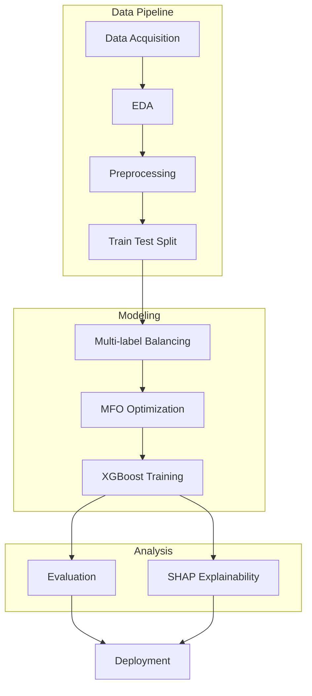

# 🔬 Project Data Mining

An advanced machine learning project focused on multi-label classification using XGBoost with optimization techniques and explainability analysis.

**Live Demo:** https://project-data-mining-jade.vercel.app

---

## 📋 Table of Contents

- [Overview](#overview)
- [Pipeline Architecture](#pipeline-architecture)
- [Tech Stack](#tech-stack)
- [Project Structure](#project-structure)
- [Getting Started](#getting-started)
- [Workflow](#workflow)
- [Key Features](#key-features)
- [Results & Evaluation](#results--evaluation)
- [Contributing](#contributing)
- [License](#license)

---

## 🎯 Overview

This project implements a comprehensive data mining solution that combines multiple advanced techniques for multi-label classification tasks. The pipeline includes:

- **Data Acquisition & Exploration** - Collect and understand data patterns
- **Advanced Preprocessing** - Clean and prepare data for modeling
- **Multi-label Balancing** - Handle class imbalance issues
- **Optimization** - Use MFO (Moth-Flame Optimization) for hyperparameter tuning
- **Model Training** - XGBoost for robust predictions
- **Explainability** - SHAP analysis for model interpretability
- **Deployment** - Production-ready web application

---

## 📊 Pipeline Architecture



---

## 🛠 Tech Stack

| Component | Technology |
|-----------|-----------|
| **Data Science** | Python, Jupyter Notebook (84.7%) |
| **ML Framework** | XGBoost, scikit-learn |
| **Optimization** | Moth-Flame Optimization (MFO) |
| **Explainability** | SHAP (SHapley Additive exPlanations) |
| **Frontend** | Next.js, TypeScript, React |
| **Deployment** | Vercel |
| **Scripting** | Python (12.5%), Shell, Batch |

---

## 📁 Project Structure

```
Project-Data-Mining/
├── notebooks/              # Jupyter notebooks for analysis
│   ├── 01_eda.ipynb       # Exploratory Data Analysis
│   ├── 02_preprocessing.ipynb
│   ├── 03_modeling.ipynb
│   └── 04_evaluation.ipynb
├── frontend/              # Next.js web application
│   ├── app/
│   ├── components/
│   └── package.json
├── src/                   # Python source code
│   ├── data/
│   ├── models/
│   ├── utils/
│   └── config.py
├── data/                  # Dataset storage
├── models/                # Trained model artifacts
├── results/               # Analysis outputs & visualizations
├── README.md
└── requirements.txt       # Python dependencies
```

---

## 🚀 Getting Started

### Prerequisites

- Python 3.8+
- Node.js 16+ (for frontend)
- pip or conda package manager

### Backend Setup

1. **Clone the repository:**
   ```bash
   git clone https://github.com/dianfauzi16/Project-Data-Mining.git
   cd Project-Data-Mining
   ```

2. **Create virtual environment:**
   ```bash
   python -m venv venv
   source venv/bin/activate  # On Windows: venv\Scripts\activate
   ```

3. **Install dependencies:**
   ```bash
   pip install -r requirements.txt
   ```

4. **Run Jupyter notebooks:**
   ```bash
   jupyter notebook
   ```

### Frontend Setup

1. **Navigate to frontend directory:**
   ```bash
   cd frontend
   ```

2. **Install dependencies:**
   ```bash
   npm install
   # or
   yarn install
   # or
   pnpm install
   ```

3. **Run development server:**
   ```bash
   npm run dev
   # or
   yarn dev
   # or
   pnpm dev
   ```

4. **Open browser:**
   Navigate to [http://localhost:3000](http://localhost:3000)

---

## 🔄 Workflow

### 1. **Data Pipeline**
- **Data Acquisition**: Collect raw data from source
- **EDA (Exploratory Data Analysis)**: Understand data distribution, patterns, and anomalies
- **Preprocessing**: Handle missing values, outliers, and feature engineering
- **Train-Test Split**: Divide data into training and testing sets

### 2. **Modeling Pipeline**
- **Multi-label Balancing**: Address class imbalance using techniques like SMOTE or weighted sampling
- **MFO Optimization**: Fine-tune hyperparameters using Moth-Flame Optimization algorithm
- **XGBoost Training**: Train gradient boosting model with optimized parameters

### 3. **Analysis Pipeline**
- **Evaluation**: Calculate metrics (Precision, Recall, F1-Score, Hamming Loss, etc.)
- **SHAP Explainability**: Generate feature importance and explain individual predictions

### 4. **Deployment**
- **Production Build**: Prepare optimized model for serving
- **Web Application**: Deploy interactive dashboard for predictions and insights
- **Monitoring**: Track model performance in production

---

## ✨ Key Features

✅ **Multi-label Classification** - Handle multiple labels per instance  
✅ **Advanced Optimization** - MFO algorithm for hyperparameter tuning  
✅ **Model Explainability** - SHAP values for transparent AI decisions  
✅ **Interactive Dashboard** - User-friendly web interface  
✅ **Production Ready** - Deployed on Vercel  
✅ **Jupyter Notebooks** - Full reproducible analysis  
✅ **Best Practices** - Clean, documented, and tested code  

---

## 📈 Results & Evaluation

The project evaluates model performance using:

- **Multi-label Metrics**: Hamming Loss, Subset Accuracy, Jaccard Score
- **Per-label Metrics**: Precision, Recall, F1-Score, ROC-AUC
- **Feature Importance**: SHAP-based feature analysis
- **Visualization**: Confusion matrices, ROC curves, SHAP plots

Results are documented in `results/` directory with detailed analysis and visualizations.

---

## 🤝 Contributing

We welcome contributions! To contribute:

1. Fork the repository
2. Create a feature branch (`git checkout -b feature/amazing-feature`)
3. Commit your changes (`git commit -m 'Add amazing feature'`)
4. Push to the branch (`git push origin feature/amazing-feature`)
5. Open a Pull Request

---

## 📝 License

This project is open source and available under the MIT License. Feel free to use it for your projects!

---

## 📧 Contact

**Author**: dianfauzi16  
**GitHub**: [@dianfauzi16](https://github.com/dianfauzi16)  
**Live Demo**: [project-data-mining-jade.vercel.app](https://project-data-mining-jade.vercel.app)

---

## 🎓 References

- [XGBoost Documentation](https://xgboost.readthedocs.io/)
- [SHAP Documentation](https://shap.readthedocs.io/)
- [Scikit-learn Multi-label Classification](https://scikit-learn.org/stable/modules/multiclass.html)
- [Moth-Flame Optimization Algorithm](https://www.sciencedirect.com/science/article/abs/pii/S0950705115001555)
- [Next.js Documentation](https://nextjs.org/docs)

---

**Last Updated**: 2026-05-25  
**Status**: ✅ Active Development