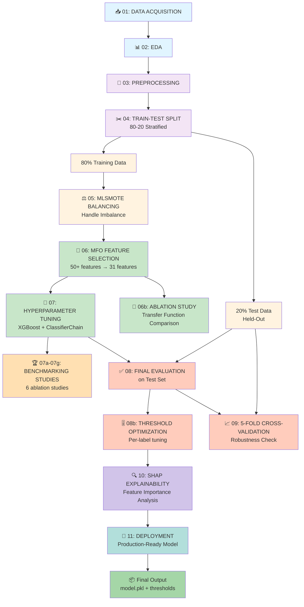
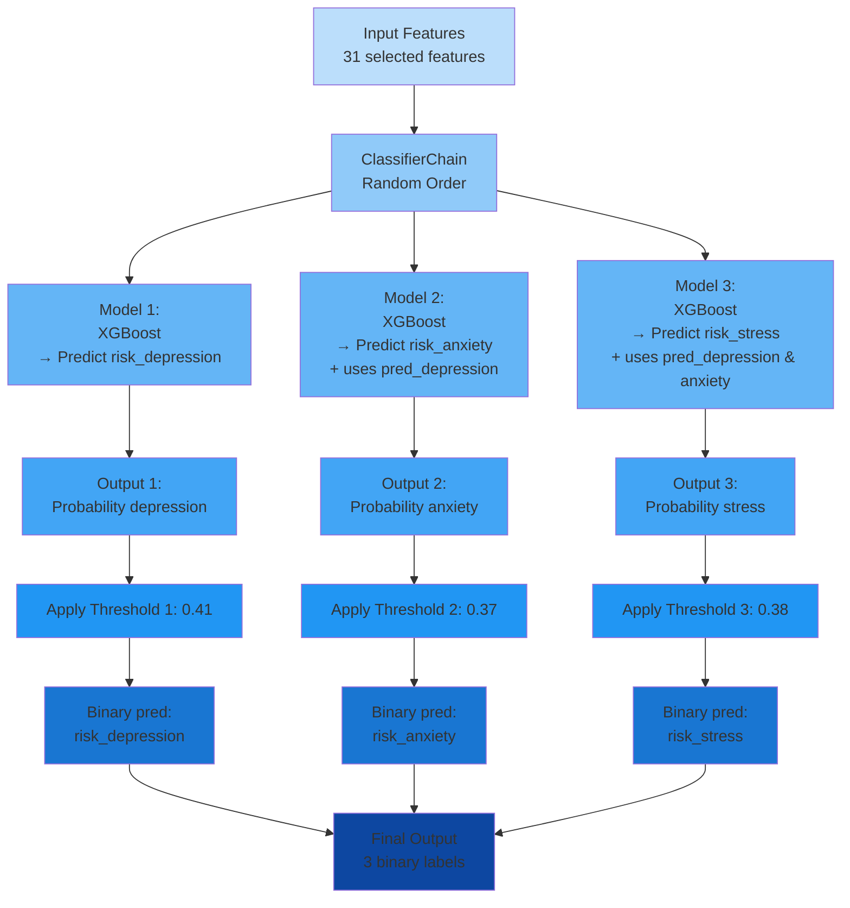
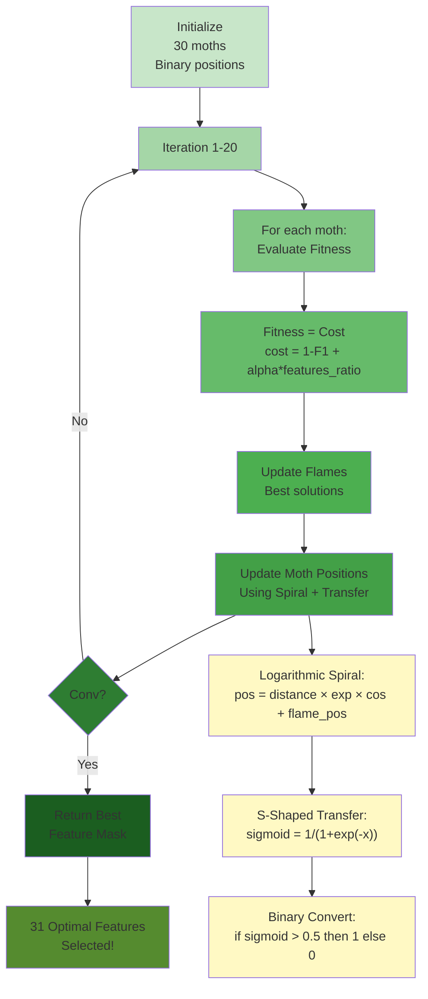
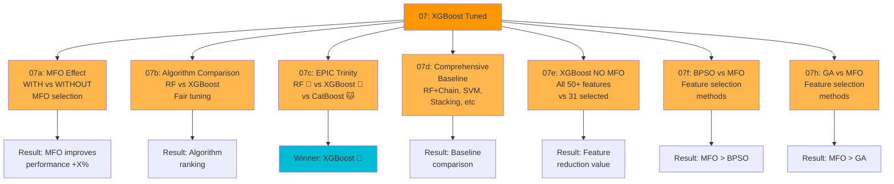
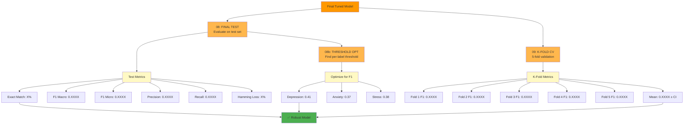
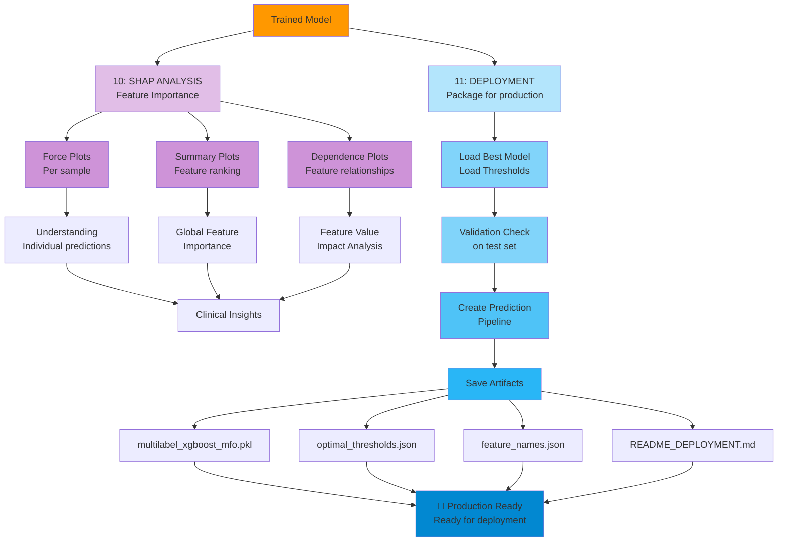
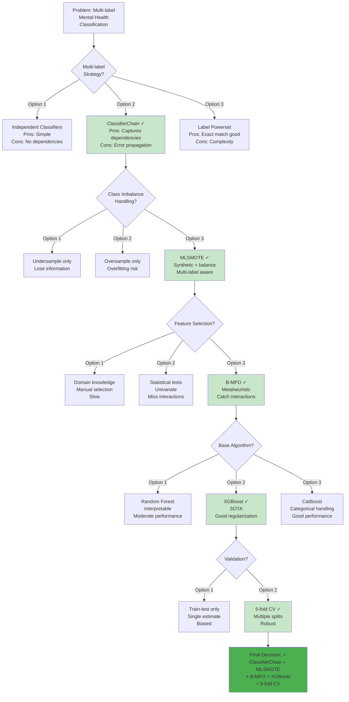

# 📊 PROJECT WORKFLOW & ARCHITECTURE DIAGRAMS

## Diagram 1: Overall Project Pipeline



---

## Diagram 2: Data Flow Through Preprocessing

```mermaid
graph LR
    A["Raw Dataset<br/>DASS-42"] -->|Age filter: 15-24| B["Filtered Data"]
    B -->|Remove outliers<br/>age=1998| C["Cleaned Data"]
    C -->|Feature Engineering<br/>DASS scores| D["Scored Features"]
    D -->|Prevent leakage<br/>Remove original Q's| E["Clean Features"]
    E -->|Stratified 80-20| F["Train: 80%"]
    E -->|Stratified 80-20| G["Test: 20%<br/>Hold-out"]
    F -->|MLSMOTE| H["Balanced Train<br/>50-50 minority-majority"]
    H -->|MFO Selection| I["Selected Features<br/>31/50+"]
    I -->|Ready for modeling| J["Training Phase"]
    G -->|Final Evaluation| K["Testing Phase"]

    style A fill:#fff3e0
    style B fill:#ffe0b2
    style C fill:#ffcc80
    style D fill:#ffb74d
    style E fill:#ffa726
    style F fill:#ff9800
    style G fill:#f57c00
    style H fill:#e65100
    style I fill:#c8e6c9
    style J fill:#81c784
    style K fill:#558b2f
```



---

## Diagram 3: Multi-Label Classification Strategy



---

## Diagram 4: MFO Feature Selection Process



---

## Diagram 5: Benchmarking Studies (Phase 5)



---

## Diagram 6: Evaluation & Validation Pipeline



---

## Diagram 7: SHAP Explainability & Deployment



---

## Tabel Komparatif: Phase Outcomes

| Phase | Notebook | Input         | Output             | Key Metric          |
| ----- | -------- | ------------- | ------------------ | ------------------- |
| **1** | 01-02    | Raw data      | Statistics & plots | Data quality ✓      |
| **2** | 03-05    | Raw → Cleaned | Balanced training  | Imbalance ratio 1:1 |
| **3** | 06-06b   | 50+ features  | 31 features        | Reduction -38%      |
| **4** | 07       | Balanced data | Tuned model        | F1 macro ~0.XXX     |
| **5** | 07a-07g  | Tuned model   | Rankings           | Ablation proven     |
| **6** | 08-09    | Model         | Metrics & CV       | F1 mean ± CI        |
| **7** | 10-11    | Model         | Production         | Explainability ✓    |

---

## Design Decision Tree



---

## File I/O Summary

```
PROJECT STRUCTURE
│
├── 📥 INPUT
│   ├── Data/raw/Dataset.csv
│   └── notebooks/*.ipynb
│
├── 🔄 PROCESSING
│   ├── Data/processed/
│   │   ├── cleaned_data.csv (03)
│   │   ├── train_balanced_multilabel.csv (05)
│   │   └── train_selected_features.csv (06)
│   │
│   └── Data/split/
│       ├── train_data.csv (04)
│       └── test_data.csv (04)
│
├── 📊 OUTPUTS
│   ├── outputs/
│   │   ├── eda_figures/ (02)
│   │   ├── imbalance_figures/ (05)
│   │   ├── shap_figures/ (10)
│   │   ├── best_matrix/ (08)
│   │   ├── ablation_results_mfo_effect.csv (07a)
│   │   └── best_parameter/ (07)
│   │
│   └── notebooks/
│       ├── classification_report.txt (08)
│       ├── optimal_thresholds.txt (08b)
│       └── MFO_ABLATION_GUIDE.md
│
├── 🤖 MODELS
│   ├── mlruns/ (MLflow tracking)
│   └── models/
│       └── multilabel_xgboost_mfo.pkl (11)
│
└── 📋 DOCUMENTATION
    ├── README.md
    ├── METHODOLOGY.md (THIS!)
    ├── requirements.txt
    └── src/
        ├── mfo_optimizer.py
        ├── model_trainer.py
        └── preprocessing.py
```

---

**Diagram ini menyajikan visualisasi lengkap dari seluruh workflow dan arsitektur project.**
